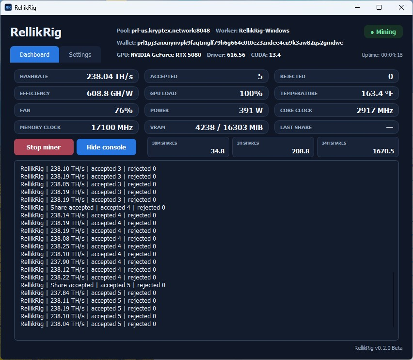
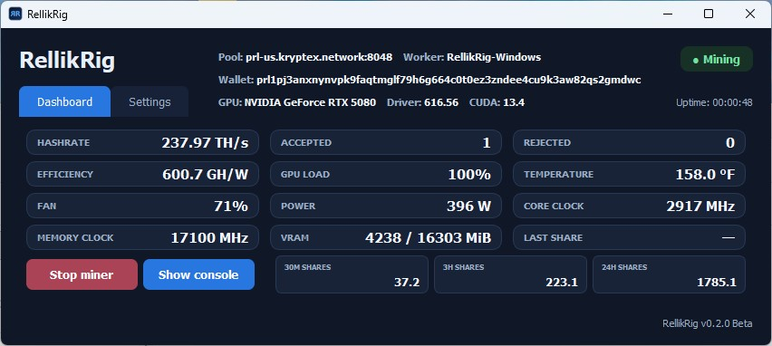
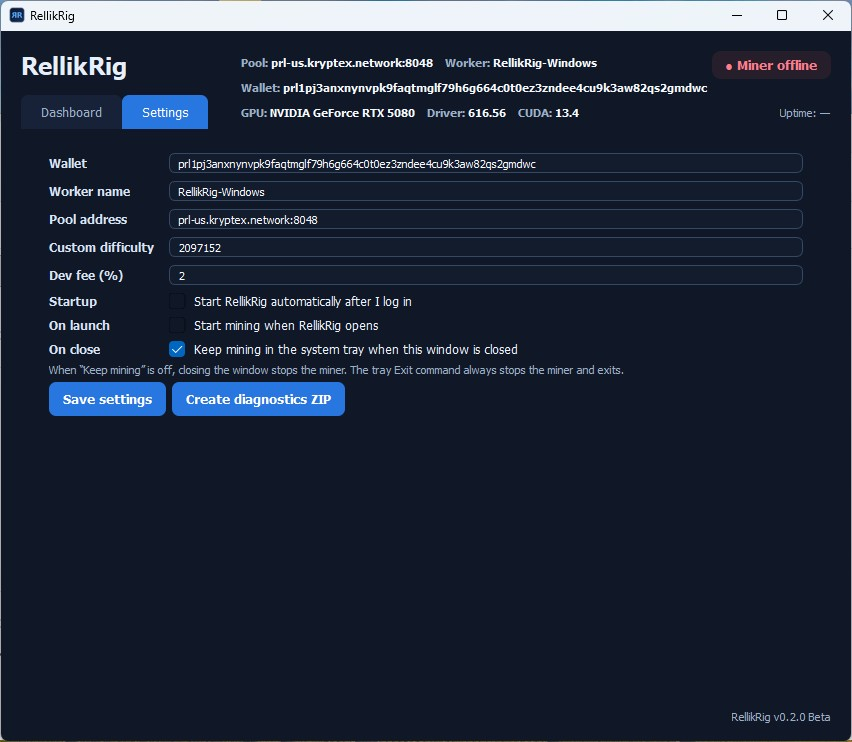

# RellikRig Pearl — 0.2.0 Beta


RellikRig is a graphical NVIDIA Pearl miner for Windows and Linux. Version 0.2.0 Beta is a self-contained desktop app for configuring the pool and wallet, starting or stopping mining, viewing live share and GPU information, using the system tray, and exporting diagnostics.


The release archives contain one executable, a short launch note, and the LGPL-3.0 notice for the Qt for Python runtime. There is no terminal workflow and no external kernel folder to manage.


## Download


Download the archive for your operating system from [Releases](https://github.com/RellikRig/RellikRig-Pearl/releases), extract it to a writable folder, and run the included executable.


| Platform | Download | Developer allocation |
| --- | --- | --- |
| Windows x64 | `RellikRig-Windows-0.2.0-Beta.zip` | Defaults to 2%; configurable from 1% to 100% in Settings |
| Linux x86-64 | `RellikRig-Linux-0.2.0-Beta.zip` | Defaults to 1%; configurable from 1% to 100% in Settings |


The beta was tested on an NVIDIA GeForce RTX 5080. The dashboard reports the detected GPU, driver, CUDA version, GPU load, temperature, fan, power, clocks, and VRAM. Test other NVIDIA cards carefully and include a diagnostics ZIP with any report.


## First run


1. Run `RellikRig.exe` on Windows or `RellikRig` on Linux.
2. Open **Settings** and review the wallet, worker name, pool address, custom difficulty, and developer allocation.
3. Click **Save settings**, then use **Start miner** on the Dashboard.
4. **Show console** and **Hide console** expand or collapse the complete live miner output inside the app; the Dashboard opens in its compact layout.
5. Closing the window keeps RellikRig in the system tray by default. Right-click the tray icon and select **Exit RellikRig** to stop mining and exit.


The default settings are intentionally usable without editing:


| Setting | Default |
| --- | --- |
| Wallet | `prl1pj3anxnynvpk9faqtmglf79h6g664c0t0ez3zndee4cu9k3aw82qs2gmdwc` |
| Worker | `RellikRig` |
| Pool | `prl-us.kryptex.network:8048` |
| Custom difficulty | `2097152` |
| Windows developer allocation | `2%` |
| Linux developer allocation | `1%` |


Change the wallet if you want shares credited to your own Pearl wallet. Leaving the default wallet mines to the project wallet.


## Dashboard


The dashboard reads RellikRig's local API at `127.0.0.1:4067` and NVIDIA's local driver tools. It does not send GUI telemetry to another service. The API remains available for local monitoring tools.





The bottom share cards estimate 30-minute, 3-hour, and 24-hour share counts from the current uptime and accepted-share rate. They are estimates, not pool accounting.# RellikRig Pearl — 0.2.0 Beta

RellikRig is a graphical NVIDIA Pearl miner for Windows and Linux. Version 0.2.0 Beta is a self-contained desktop app for configuring the pool and wallet, starting or stopping mining, viewing live share and GPU information, using the system tray, and exporting diagnostics.

The release archives contain one executable, a short launch note, and the LGPL-3.0 notice for the Qt for Python runtime. There is no terminal workflow and no external kernel folder to manage.

## Download

Download the archive for your operating system from [Releases](https://github.com/RellikRig/RellikRig-Pearl/releases), extract it to a writable folder, and run the included executable.

| Platform | Download | Developer allocation |
| --- | --- | --- |
| Windows x64 | `RellikRig-Windows-0.2.0-Beta.zip` | Defaults to 2%; configurable from 1% to 100% in Settings |
| Linux x86-64 | `RellikRig-Linux-0.2.0-Beta.zip` | Defaults to 1%; configurable from 1% to 100% in Settings |

The beta was tested on an NVIDIA GeForce RTX 5080. The dashboard reports the detected GPU, driver, CUDA version, GPU load, temperature, fan, power, clocks, and VRAM. Test other NVIDIA cards carefully and include a diagnostics ZIP with any report.

## First run

1. Run `RellikRig.exe` on Windows or `RellikRig` on Linux.
2. Open **Settings** and review the wallet, worker name, pool address, custom difficulty, and developer allocation.
3. Click **Save settings**, then use **Start miner** on the Dashboard.
4. **Show console** and **Hide console** expand or collapse the complete live miner output inside the app; the Dashboard opens in its compact layout.
5. Closing the window keeps RellikRig in the system tray by default. Right-click the tray icon and select **Exit RellikRig** to stop mining and exit.

The default settings are intentionally usable without editing:

| Setting | Default |
| --- | --- |
| Wallet | `prl1pj3anxnynvpk9faqtmglf79h6g664c0t0ez3zndee4cu9k3aw82qs2gmdwc` |
| Worker | `RellikRig-FastSwizzle343` |
| Pool | `prl-us.kryptex.network:8048` |
| Custom difficulty | `2097152` |
| Windows developer allocation | `2%` |
| Linux developer allocation | `1%` |

Change the wallet if you want shares credited to your own Pearl wallet. Leaving the default wallet mines to the project wallet.

## Dashboard

The dashboard reads RellikRig's local API at `127.0.0.1:4067` and NVIDIA's local driver tools. It does not send GUI telemetry to another service. The API remains available for local monitoring tools.


The bottom share cards estimate 30-minute, 3-hour, and 24-hour share counts from the current uptime and accepted-share rate. They are estimates, not pool accounting.



## Settings, startup, and diagnostics

Settings includes the wallet, worker name, pool address, optional custom share difficulty, Windows developer allocation, login startup, launch mining, and close behavior. RellikRig remembers its window position and keeps a single GUI instance active.



**Suggestions are welcomed and encouraged.** If something fails or looks wrong, use **Create diagnostics ZIP** in Settings and attach that ZIP to a GitHub Issue. It includes the application version, GPU/driver information, local API health, and a redacted mining summary so a report can be investigated without asking you to reproduce the problem.

Include the operating system, GPU, NVIDIA driver version, pool address, and a short description of what happened. Do not include passwords, private keys, or unrelated personal files.

## Pool and fee behavior

RellikRig uses the Pearl pool protocol with GZIP v2 proof submissions. The pool target remains authoritative even when custom difficulty is requested. The developer allocation uses the configured pool and resumes normal mining at the end of its scheduled window.

- Windows: the selected percentage is scheduled across each 1,800-second cycle. The default 2% is 36 seconds; the minimum 1% is 18 seconds.
- Linux: the selected percentage is scheduled across each 1,800-second cycle. The default 1% is 18 seconds; the maximum 100% is the full cycle.

No GPU clocks, voltage, power limit, or fan setting is changed by RellikRig.

## Beta status

The native Windows 0.2.0 Beta test started a connected RTX 5080 mining session around 238 TH/s, recorded accepted shares with zero rejected shares, detected CUDA 13.4, and kept all output in the embedded console with no Command Prompt window. This is beta software: verify behavior and stability on your own system and share diagnostics for any issue.

See [CHANGELOG.md](CHANGELOG.md), [SECURITY.md](SECURITY.md), and [THIRD_PARTY.md](THIRD_PARTY.md) for release details.
# RellikRig Pearl 0.1.4

Closed-source Pearl V3 rank-128 miner for NVIDIA RTX 5080 (SM120).

| Platform | Package | Developer fee |
| --- | --- | --- |
| Windows x64 | `RellikRig-Pearl-0.1.4-windows-x86_64-sm120.zip` | **2% — 36 seconds per 30 minutes** |
| Linux x86-64 | `RellikRig-Pearl-0.1.4-linux-x86_64-sm120.tar.gz` | **1% — 18 seconds per 30 minutes** |

Download the named binary assets and SHA256 checksums from
[GitHub Releases](https://github.com/RellikRig/RellikRig-Pearl/releases).
GitHub's automatic “Source code” archives contain documentation, not the miner.
Implementation source is private; required third-party notices ship in each package.

## Windows

Extract the entire ZIP into a writable folder. Edit `Start-RellikRig.bat` and
replace `YOUR_PEARL_WALLET` with your own `prl1...` wallet. Double-click the launcher.
It verifies a GPU-generated proof on the CPU before mining and stops on failure.
Keep all extracted files together. Alternatively, use a terminal in that folder:

```bat
rellikrig.exe selftest
rellikrig.exe mine --wallet YOUR_PEARL_WALLET --worker MyRig
```

Requires Windows x64 and an NVIDIA Windows driver supporting RTX 5080.
No Python, Rust or CUDA Toolkit installation is needed. `Diagnostics.bat` and
`Run-Self-Test.bat` save diagnostic output.

## Linux

Requires Linux x86-64, glibc 2.34+, NVIDIA driver (tested: 595.91.07), CA
certificates and standard C/GCC runtime libraries. Application runtime is bundled.

```bash
sha256sum -c SHA256SUMS
tar -xzf RellikRig-Pearl-0.1.4-linux-x86_64-sm120.tar.gz
cd RellikRig-Pearl-0.1.4-linux-x86_64-sm120
./rellikrig doctor
./rellikrig mine --wallet YOUR_PEARL_WALLET --worker MyRig
```

Stop other GPU compute workloads first. Press Ctrl+C to stop mining. The miner
changes no clocks, voltages, power limits, fan settings or startup configuration.
Only RTX 5080 is tested; support/performance on other hardware is unvalidated.

## Cleaner console, API retained

Version 0.1.4 removes raw diagnostic JSON from the console, including `event`,
`b_snapshot_bytes`, job targets and engine setup details. The console still shows
hashrate, accepted/rejected shares, connection status, fee, and actionable errors.

**The local read-only API remains at http://127.0.0.1:4067/summary on both platforms.**
GPU telemetry, compression statistics and detailed JSON logs are retained.
Use `--api-port 0` to disable the API. `--log FILE` selects a log file; the default
is `rellikrig.jsonl` beside the executable. No external analytics service is used.
The local temperature guard still stops mining at 83 C by default.

## Developer allocation

Windows: the final **36 seconds** of every **1800-second** cycle (**2%**).
Linux: the final **18 seconds** of every **1800-second** cycle (**1%**).

Developer wallet:
`prl1pj3anxnynvpk9faqtmglf79h6g664c0t0ez3zndee4cu9k3aw82qs2gmdwc`

The developer worker is `RellikRig-DevFee`; both allocations use your selected
pool. User mining resumes after the fee window. The cycle starts at process
startup. Percentages describe wall-clock allocation, not exact shares or revenue.
If already mining to the developer wallet, the connection is retained. Public
binaries have no fee-disable command-line option.

## Pool protocol

Default: `prl-us.kryptex.network:8048`, certificate-verified TLS. GZIP v2 is
negotiated and explicitly confirmed before mining. Repetitive raw matrix data
makes verified proofs compressible without altering a completed proof.

Use `--difficulty NUMBER` to request custom share difficulty (pool password
`d=NUMBER`); the pool's returned target stays authoritative. Do not combine
`--difficulty` and `--password`. Alternate pools must support the same Pearl V3
TLS protocol. `SSL_CERT_FILE` may select a CA bundle without disabling verification.

## Validation and limits

| Baseline platform | Available log duration | Mean local TH/s | Accepted | Rejected |
| --- | --- | --- | --- | --- |
| Linux 0.1.3 | 25 h 2 m | 239.18 | 2,302 | 1 stale |
| Windows test build | 6 h 46 m | 230.81 | 670 | 1 stale |

Neither baseline recorded invalid proofs. Both recovered from network/pool
interruptions. Windows GPU/CPU proof self-test passed. The Windows logs do not
establish a 24-hour run; the 25-hour run was Linux. Measurements are from one
tuned RTX 5080 and do not guarantee performance or long-term stability elsewhere.

Release 0.1.4 retains each platform's native engine and CUDA files byte for byte.
The controller changes passed **26 Linux tests** and **30 Windows Python/Wine
tests**, including fee scheduling, console filtering, retained API and protocol
validation. The changed Windows package has not yet had a native Windows soak
test. See platform-specific `VALIDATION*.json` for exact evidence and limits.

## Support

Open an issue with version, OS, GPU/driver, pool and a short sanitized log excerpt.
Do not include private keys, passwords or unrelated personal information.
See `SUPPORT.md`, `LICENSE.txt` and the packaged third-party notices.

The packaged Linux 0.1.4 live check passed the GPU/CPU self-test and ran 90.1 seconds at 239.59 TH/s, with 3 accepted shares, 0 rejects and 0 stale drops. Its retained API was verified. This short check does not replace the longer baseline test.
